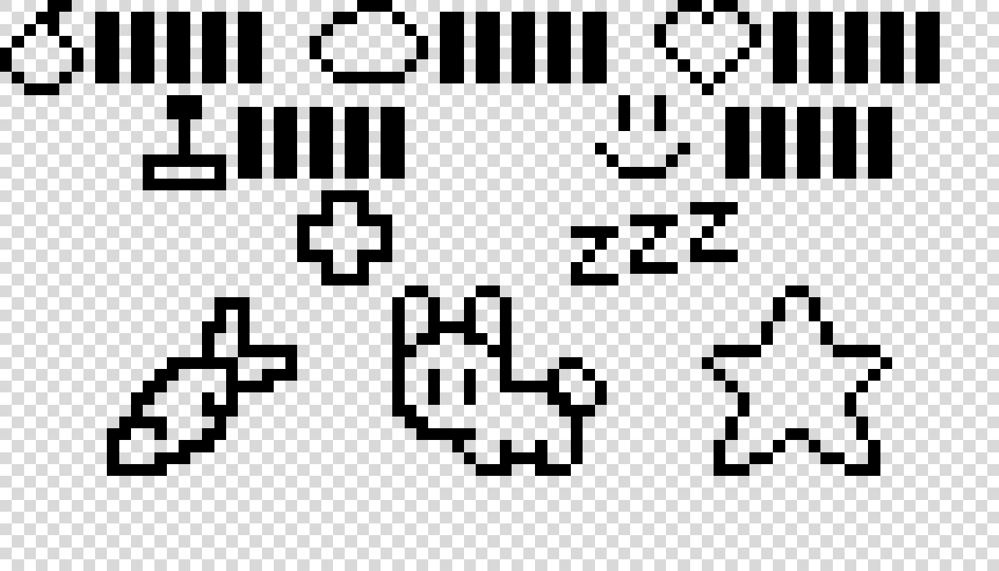

# NOKIA 5110 

Este utiliza dos archivos principales master y config descripcion como aqui abajo 
simulacion + como dibuja en pixels, actualizar disbujos 

simulacion master
simulacion config

config utiliza la señal de control done para comunicarse con la maquina de estados ademas recibe como entrada el numero correspondiente al dibujo que se va a hacer, con la señal draw. 

quitar todo lo de core. 

***

En este archivo se encuentran tres archivos + sus respectivos testbench.
* master: se encarga de "separar" el mensaje y enviarlo bit pot bit a la pantalla nokia tambien se encarga del reloj secundario.
* config: este tiene las secuencias necesarias para dibujar cada diseño (como iconos la mascota etc) en la pantalla, utiliza la señal de control avail del master para enviar un neuvo mensaje, tambien controla "comm" que es 0 para un comando (por ej configuracion o posicion) y 1 para un mensaje a escribir (dibujar en pantalla).
* core: este es una archivo provisional para controlar que se dibuja y cuando se dibuja, usa las señales de control mascota y done. Este sera reemplazado  por la maquina central de estados pero nos ayuda a ver como funciona la transicion entre un dibujo y otro. Tambien controla el backlight.

  

## Detalles con layout 

Este layout se divide en dos partes en orden de visulaizacion, una primera parte es la configuracion inicial los iconos de estados y el conejo (por el momento) estos se dibujan uno tras otro, al finalozar se envia la señal mascota =1 a core.

En una segunda parte son los dibujos que dependen de los estados, por ejemplo las barras recibin el valor de nivel de core, y cada uno se puede dibujar de manera independiente segun se necesite tambien se tiene una funcion que limpia esta zona de la pantalla (aun por mejorar). Permite cambiar de dibujo con casos y la señal de control done, que es 0 mientras que se dibuja y 0 al finalizar. 

