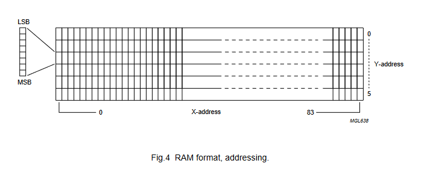
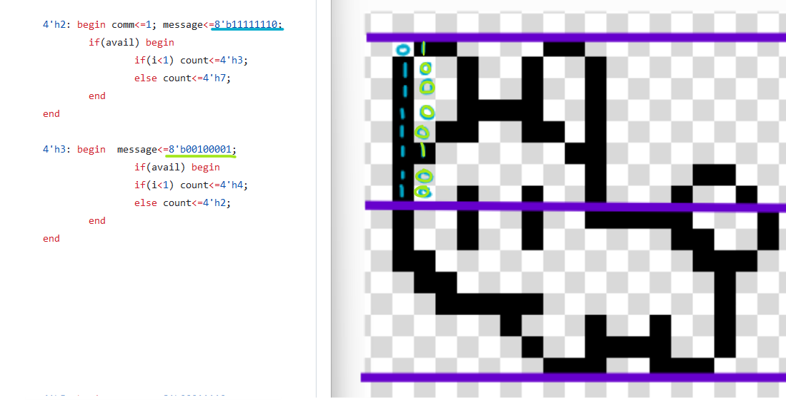
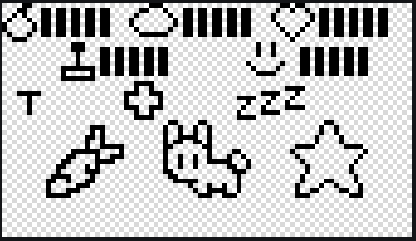

# NOKIA 5110 

La pantalla utiliza el protocolo SPI, para comunicarse con ella se utilizan dos archivos principales llamados master y config: 

* Master: se encarga de "separar" el mensaje y enviarlo bit pot bit a la pantalla Nokia, también se encarga del reloj secundario, el cuál es necesario pues la frecuencia de la pantalla es de máximo 4MHz, mientras que la FPGA opera a 50MHz.

  
* Config: este tiene las secuencias necesarias para dibujar cada diseño (como iconos, la mascota, etc), utiliza la señal de control `avail` del master para enviar un nuevo mensaje, también controla la señal D/C (data/comando) que es 0 para un comando (como configuración o posición) y 1 para un mensaje a escribir (dibujar en pantalla). A su vez, este se comunica con la maquina de estados principal con la señal de control `done`, que es 0 mientras se dibuja una secuencia y 1 cuando finaliza.


Para dibujar se usa un direccionamiento horizontal, dibujando 8 pixeles a la vez de manera vertical en una dirección que va de 0 a 84 horizontalmente, también se puede posicionar en cualquiera de las 5 filas. Así, luego de dibujar una línea, la siguiente se dibuja a la derecha automáticamente. 

[](fig)
[](fig)

Dentro del código de este archivo, cada diseño es un caso, dentro del primer caso a su vez esta el caso con las secuencias de los diseños inciales (iconos, conejo) estos se dibujan de manera secuencial al iniciar o reiniciar el tamagotchi.

[](fig)

Además, se tiene un estado transitorio, llamado `STANDBY` donde se ubica luego de terminar un diseño (`done=1`) en este estado se lee la entrada del diseño a dibujar, proveniente de la maquina de estados.

```verilog
STAND_BY: begin 
  count<=4'h0;
  if(sketch != draw) sketch<=draw;
end
```


* Conexión con la maquina de estados: usando `done` como señal de control, se envía el número del diseño a dibujar, y se dibuja de mánera cíclica:
  * Barras: muestran los niveles de estados de 1-5.
    * Pera: alimento.
    * Nube: descanso.
    * Corazon: salud.
    * Juego: diversión.
    * Carita feliz: animo.
  * Caritas: según los niveles de los estados, está la carita feliz, neutra, triste o muerta. 
  * Iconos: aparecen según las acciones o interacciones que se realizan con la mascota.
    *  Zanahoria: alimentar.
    *  Cruz: sanar.
    *  Zzz: descansar/dormir.
    *  Estrella: jugar.
   
  Además, se tiene un icono T que indica si se está en modo test, y una función de limpieza parcial que limpia los iconos en pantalla antes de dibujar uno nuevo.

  [](fig)

### Simulaciones

* simulacion master
* simulacion config
* simulacion solo maquina de estados
* 
			

